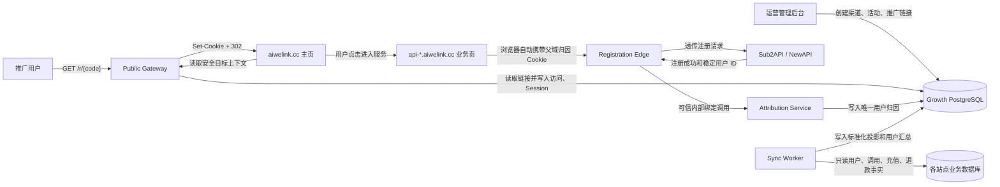
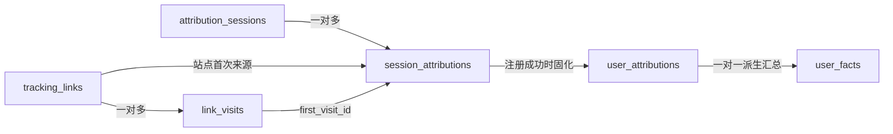

# AIWeLink 主页与归因 Session 项目文档

## 1. 文档状态

- 日期：2026-07-24。
- 状态：V1 已确认设计，可用于新主页项目立项和后续实施计划。
- 主页域名：`https://aiwelink.cc`。
- API 业务站：`https://api.aiwelink.cc`、`https://api-us.aiwelink.cc` 等受信任的 `*.aiwelink.cc` 分站。
- 推广链接：`https://aiwelink.cc/r/{code}`。
- 归因方式：同主域服务端归因 Session。

本文聚焦主页、推广入口和实际 API 业务站之间的数据流。渠道、活动、推广链接管理及调用、充值、退款同步的完整定义继续以现有 Growth 数据平台需求文档为准。

## 2. 已确认决策

V1 固定采用以下方案：

1. 只支持受信任的 `*.aiwelink.cc` 同主域站点。
2. `/r/{code}` 是后端路由，不进入主页 SPA 渲染。
3. `/r/{code}` 创建服务端归因 Session，并设置父域 Cookie。
4. 不使用跨主域 Token、handoff、邀请码或 `?ref=xxxx`。
5. URL 中不传递推广来源、Session ID、用户 ID 或其他归因信息。
6. 归因 Session 与 Sub2API/NewAPI 的登录 Session 完全独立。
7. 一个站点账号最多归入一条推广链接。
8. V1 使用按站点独立计算的首次有效触达：同一浏览器在同一站点先后访问多条推广链接时，保留该站点 30 天窗口内最早的有效链接；不同站点互不占用窗口。
9. 注册成功并绑定后，后续点击其他推广链接不改写账号来源。
10. 跨主域归因不属于 V1；未来需要时另立项目设计。

本设计替代旧讨论稿中 V1 的 `signed_handoff`、跨主域 Token 和 URL `ref` 方案。数据库兼容字段 `binding_mode` 可以暂时保留 `shared_parent_cookie`，但 V1 页面不再让运营人员选择绑定方式。

## 3. 项目目标

新主页项目需要同时完成三件事：

1. 在 `aiwelink.cc` 提供品牌主页和进入 API 服务的统一入口。
2. 处理 `aiwelink.cc/r/{code}`，记录推广访问并创建归因 Session。
3. 将归因 Session 安全地带到目标 API 分站，在注册成功后绑定稳定用户 ID。

最终系统必须能够回答：

```text
哪个渠道、活动、帖子、群或推荐人
→ 带来了哪个匿名访问
→ 用户后来在哪个 API 分站注册
→ 对应哪个业务用户 ID
→ 后续是否成功调用、充值、二次充值、继续调用和退款
```

## 4. 非目标

V1 不做以下事项：

- 不在主页实现真实注册、登录、充值或 API 控制台。
- 不复制或同步业务站登录 Session。
- 不把推广来源写入 Sub2API/NewAPI 核心用户表。
- 不修改开源 Sub2API 的核心注册和认证逻辑。
- 不支持 `aiwelink.cn`、第三方域名或其他跨主域站点。
- 不使用浏览器指纹、IP、邮箱或时间接近度猜测来源。
- 不承诺跨设备、无痕模式或清除 Cookie 后继续识别同一用户。
- 不把密码、验证码、登录 Cookie、JWT、API Key 或支付密钥写入 Growth PostgreSQL。
- 不在 URL 中保留公开邀请码、Token 或归因参数。

## 5. 系统边界

### 5.1 新主页代码库

新主页使用独立代码库 `aiwelink-homepage`：

```text
aiwelink-homepage
├── apps/homepage-web           # aiwelink.cc 主页前端
├── services/public-gateway     # /r、Session、主页公开上下文和内部注册绑定
├── services/registration-edge  # API 分站前置注册归因适配器
├── packages/contracts          # 公开和内部接口契约
├── deploy                      # CDN、Nginx、容器和环境配置
└── tests                       # 单元、集成和端到端测试
```

这是一份逻辑结构，不强制具体前端或后端框架。主页前端和公开网关必须可以独立部署，避免修改页面时影响 `/r/*` 的稳定性。

本文中的 Attribution Service 是 Public Gateway 内受服务身份保护的内部模块，不是另一套公开页面。V1 保持一个后端部署；流量或团队边界需要时再独立拆分，接口契约不变。

### 5.2 当前管理后台

当前管理后台继续负责：

- 客户站点管理；
- Growth PostgreSQL 配置和迁移；
- 站点、渠道、活动和推广链接管理；
- 运营看板和账号详情查询；
- `owner/admin` 权限与操作审计。

主页项目不再实现一套重复的运营管理页面。

### 5.3 API 业务站

Sub2API/NewAPI 等业务系统继续拥有：

- 注册和登录；
- 业务登录 Session；
- 用户 ID；
- API 调用事实；
- 充值、到账和退款事实。

API 分站只增加外置的注册归因适配层，不要求把 Growth 代码合并进开源业务仓库。

### 5.4 Growth PostgreSQL 访问边界

管理后台、Public Gateway 和 Sync Worker 使用同一个 Growth PostgreSQL，但使用不同的数据库身份：

| 组件 | 必要权限 |
|---|---|
| 管理后台 | 执行迁移；管理站点、渠道、活动和推广链接；读取看板数据 |
| Public Gateway | 读取有效站点和推广配置；写入访问、归因 Session、站点首次触达和用户归因 |
| Sync Worker | 读取用户归因；写入调用、账单投影和用户汇总 |

管理后台中的数据库配置是连接该 Growth PostgreSQL 的权威配置。部署系统或密钥管理服务向 Public Gateway 和 Sync Worker 注入各自的最小权限凭据；主页浏览器、API 业务前端和 Sub2API 都不能取得数据库连接串。服务之间不复制 Growth 数据，也不通过业务站数据库传递归因 Session。

## 6. 域名与路由

生产路由固定为：

| 域名与路径 | 处理方 | 作用 |
|---|---|---|
| `aiwelink.cc/` | 主页前端 | 品牌主页和 API 入口 |
| `aiwelink.cc/r/{code}` | Public Gateway | 记录访问、创建 Session、返回 302 |
| `aiwelink.cc/api/public/growth-context` | Public Gateway | 读取归因 Session，返回安全的目标站上下文 |
| `api.aiwelink.cc/*` | API 业务站 | 实际注册、登录和 API 控制台 |
| `api-us.aiwelink.cc/*` | API 业务站 | 美国等分站业务页面 |
| `/internal/growth/registrations/bind` | Attribution Service | 可信服务调用的注册绑定接口 |

CDN、Nginx 或反向代理必须在主页静态文件和 SPA fallback 之前匹配 `/r/*` 与 `/api/public/*`。

## 7. 总体数据流



核心原则是：浏览器只携带一个无权限的随机 Session ID；`/r/{code}` 的真实来源信息始终留在 Growth PostgreSQL，不传入地址栏，也不写入业务站登录 Session。

## 8. 推广访问链路

### 8.1 请求

用户访问：

```http
GET https://aiwelink.cc/r/7km4q2xd
```

### 8.2 Public Gateway 处理

Public Gateway 按以下顺序处理：

1. 规范化并校验 `code`。
2. 查询 `growth.tracking_links`。
3. 校验链接、活动和站点均处于可用状态，并检查有效时间。
4. 读取现有 `awl_growth_sid` Cookie。
5. Cookie 缺失、失效或服务端 Session 已过期时，生成新的高强度随机 Session ID。
6. 以 Session ID 的服务端摘要生成匿名访客键，不保存原始 Cookie 值。
7. 写入一条 `growth.link_visits` 访问事件。
8. 按 `(session, site_id)` 保留该站点 30 天窗口内的首次有效推广触达；窗口到期后，下一次有效触达可建立新的 30 天窗口。
9. 将 Session 的当前目标站点更新为本次链接的 `site_id`，但不因此覆盖该站点窗口内的首次来源。
10. 返回父域 Cookie，并把服务端 Session 的技术有效期刷新到当前时间后 30 天。
11. 返回 `302` 到干净的 `https://aiwelink.cc/`，URL 不附加任何归因参数。

### 8.3 Cookie

V1 Cookie 名称固定为：

```text
awl_growth_sid
```

响应属性：

```http
Set-Cookie: awl_growth_sid=<256-bit-random-value>;
  Domain=.aiwelink.cc;
  Path=/;
  HttpOnly;
  Secure;
  SameSite=Lax;
  Max-Age=2592000
```

要求：

- Cookie 只用于归因，不具有认证、授权或登录能力。
- Cookie 中不保存 `code`、`tracking_link_id`、`site_id`、用户 ID 或来源名称。
- 数据库保存 Session ID 的 HMAC/SHA-256 摘要，不保存浏览器原值。
- 每个站点的归因窗口从该站点首次有效触达开始固定为 30 天，不因同站点重复点击延长。
- Cookie 和服务端 Session 的技术有效期可在新的有效推广访问时刷新；这只维持匿名会话标识，不改变任何尚未到期的站点首次来源及其到期时间。
- 所有可接收父域 Cookie 的子域必须由 AIWeLink 控制并保持可信。

## 9. Session 与数据表

### 9.1 Session 记录

新增服务端归因 Session 表，固定命名为 `growth.attribution_sessions`：

| 字段 | 含义 |
|---|---|
| `session_key_hash` | 原始 Cookie 的服务端摘要，主键 |
| `anonymous_visitor_key` | 用于访问人数去重的匿名键 |
| `current_site_id` | 最近一次有效推广访问的目标站点，供主页选择目标 API 分站 |
| `created_at` | Session 创建时间 |
| `expires_at` | Session ID 的技术失效时间；新的有效推广访问可刷新到当前时间后 30 天 |
| `last_seen_at` | 最近一次有效访问时间 |
| `status` | `active`、`expired` 或 `revoked` |

为了支持同一浏览器访问不同 API 分站，首次触达按站点保存在 `growth.session_attributions`：

| 字段 | 含义 |
|---|---|
| `session_key_hash` | 归因 Session 摘要 |
| `site_id` | 目标业务站点 |
| `tracking_link_id` | 该站点首次有效推广链接 |
| `first_visit_id` | 首次有效访问事件 |
| `first_touched_at` | 首次有效触达时间 |
| `expires_at` | 该站点首次触达窗口的固定失效时间，即 `first_touched_at + 30 天` |

主键为 `(session_key_hash, site_id)`。窗口未到期时冲突写入必须保持原记录；窗口到期后，下一次有效触达可以原子替换为新的首次来源并开始新的 30 天窗口。实现时使用事务和带到期条件的 UPSERT，避免并发点击改写窗口内来源。

### 9.2 与现有表的关系



- `link_visits` 保存每次访问事件。
- `attribution_sessions` 表示浏览器持有的服务端归因会话。
- `session_attributions` 保存该会话在每个站点当前 30 天窗口内的首次有效来源。
- `user_attributions` 保存注册账号的永久唯一来源。
- `user_facts` 保存注册后调用和付费里程碑的派生结果。

## 10. 主页如何取得目标 API 分站

### 10.1 公开上下文接口

主页不能读取 `HttpOnly` Cookie。主页加载后调用同源接口：

```http
GET https://aiwelink.cc/api/public/growth-context
Cookie: awl_growth_sid=...
```

接口读取 Session 的 `current_site_id`，并校验该站点的 `session_attributions` 尚未到期。接口只返回主页跳转所需的安全公开信息：

```json
{
  "attributed": true,
  "site": {
    "site_id": "aiwelink-us",
    "site_name": "AIWeLink US",
    "base_url": "https://api-us.aiwelink.cc"
  },
  "target_url": "https://api-us.aiwelink.cc/register",
  "expires_at": "2026-08-23T08:00:00Z"
}
```

不得返回：

- 原始 Session ID；
- 推广链接内部 UUID；
- 渠道、活动和具体帖子名称；
- 用户 ID；
- 数据库状态或错误详情。

响应必须设置 `Cache-Control: no-store`。

### 10.2 主页入口行为

主页根据上下文处理入口：

- 有有效归因 Session：注册和进入服务按钮优先指向 `current_site_id` 对应站点的 `target_url`。
- 无归因 Session：使用默认 API 站点，或让用户选择可用分站。
- 上下文接口失败：主页仍可打开；按钮降级到默认 API 站点，但不得猜测或伪造归因。
- 用户主动选择另一个站点：允许正常访问，但原推广链接不能绑定到不匹配的站点账号。

主页只使用 `target_url` 做普通顶层导航：

```text
window.location.href = target_url
```

不拼接 `ref`、Token、Session ID 或推广 code。

## 11. 数据如何到达实际 API 业务页

用户点击主页按钮进入：

```text
https://api-us.aiwelink.cc/register
```

因为浏览器已经持有 `Domain=.aiwelink.cc` 的 Cookie，请求会自动携带：

```http
Cookie: awl_growth_sid=...
```

这一步不需要：

- URL 参数；
- 前端复制 Token；
- localStorage；
- 登录 Session 同步；
- 跨域 JavaScript 传值。

API 业务前端不读取归因 Cookie。`HttpOnly` 保证 JavaScript 无法访问它。Cookie 只由 API 分站前面的 Registration Edge 读取。

这里“数据到达 API 业务页”的准确含义是：页面请求和后续注册请求携带同一个不透明 Cookie，而不是把渠道、活动或推广 code 交给业务前端。实际注册 POST 必须通过该站点登记的 Registration Edge；如果业务前端把注册请求直接发送到不受支持的第三方域名，或者 CDN/反向代理删除了该 Cookie，该站点无法完成注册归因。

## 12. 注册成功后的用户绑定

### 12.1 推荐接入方式

在每个 API 分站前部署轻量 Registration Edge：

```text
浏览器注册请求
→ Registration Edge 读取 awl_growth_sid
→ 原请求透明转发给 Sub2API/NewAPI
→ 业务系统完成注册并返回成功结果
→ Edge 取得稳定 external_user_id
→ Edge 调用 Growth 内部绑定接口
→ 原注册响应和业务登录 Cookie 原样返回浏览器
```

除明确的注册成功链路外，其他 API 请求应直接透传，不增加 Growth 处理。

### 12.2 内部绑定接口

概念接口：

```http
POST /internal/growth/registrations/bind
Authorization: Service <site-service-credential>
Content-Type: application/json
```

概念请求：

```json
{
  "site_id": "aiwelink-us",
  "external_user_id": "84521",
  "source_registration_id": "registration-84521",
  "registered_at": "2026-07-24T08:00:00Z",
  "growth_session": "<opaque-value-from-cookie>"
}
```

约束：

- 只能由登记过的站点服务身份调用。
- 服务身份只能写自己的 `site_id`。
- 接口不得接受浏览器直接提交的 `external_user_id` 作为可信事实。
- 原始 Session 值只在受保护的内部请求中短暂传输，不写日志和审计。
- Attribution Service 对 Session 做摘要后查询，不保存原始值。
- Session 必须存在、未过期，并包含相同 `site_id` 的首次有效触达。
- 对应 `session_attributions` 必须仍在该站点独立的 30 天窗口内。
- `(site_id, external_user_id)` 唯一，重复调用返回既有归因。
- 已有账号登录不能调用注册绑定接口。
- 注册失败、验证码失败或事务回滚不能产生归因。

### 12.3 如何取得稳定用户 ID

按优先级选择：

1. 使用注册成功响应中明确、稳定的用户 ID。
2. 注册成功后，使用业务系统刚创建的登录 Session 调用官方“当前用户”接口。
3. 使用业务系统提供的正式注册事件或 webhook。

禁止通过邮箱、昵称、IP、最后插入记录或时间相近猜测用户 ID。如果当前业务系统无法可靠取得用户 ID，该站点的注册归因能力必须标记为“未接入”。

### 12.4 注册补绑与重试

业务注册成功后，即使 Growth 服务暂时不可用，也不能让已确认的来源静默丢失。Registration Edge 必须在返回业务成功响应前，将待绑定任务写入自身的本地持久队列，然后异步调用内部绑定接口：

1. 队列只保存 `site_id`、稳定 `external_user_id`、`source_registration_id`、`registered_at` 和归因 Session 证据。
2. 原始 `awl_growth_sid` 如需进入队列，必须使用专用密钥加密后落盘，禁止明文保存、打印或进入通用消息追踪；任务成功或超过对应归因窗口后立即删除。
3. 队列写入失败时应产生高优先级告警，但不能回滚已经成功的业务注册。
4. 重试使用 `source_registration_id` 和 `(site_id, external_user_id)` 保证幂等，指数退避且不超过归因证据有效期。
5. Attribution Service 成功解析 Session 后，只把摘要、`first_visit_id` 和 `tracking_link_id` 等可审计证据写入 Growth PostgreSQL，不保存原始 Cookie。

该队列属于 Registration Edge 的可靠交付能力，不是浏览器 Token、跨域 handoff 或登录 Session 同步。

## 13. 绑定后的业务数据流

账号来源绑定后，后续行为不再依赖浏览器 Session：

```text
(site_id, external_user_id)
→ user_attributions.tracking_link_id
→ channel / campaign / concrete source
```

Sync Worker 通过客户站点已经配置的业务数据库连接只读同步：

- 注册时间；
- 成功模型调用；
- 首次和最近成功调用时间；
- 独立成功充值订单；
- 第二笔成功充值；
- 退款事实；
- 后续继续调用。

这些事实按 `(site_id, external_user_id)` 关联到既有归因，再生成 `user_facts`。注册完成后，即使用户清除归因 Cookie，也不影响已经锁定的来源和后续指标。

## 14. 主页功能范围

V1 主页至少提供：

- AIWeLink 品牌和产品定位；
- API 服务入口；
- 注册和登录入口；
- 可用 API 分站选择；
- 文档、服务状态、支持和必要法律链接；
- 归因上下文驱动的目标站按钮。

主页不展示推广 code、渠道、活动或“正在追踪”等内部信息。视觉设计、营销文案和内容结构可在独立的主页 UI 设计文档中确定。

## 15. 配置来源

### 15.1 站点配置

目标 API 域名不得在主页项目中硬编码。Public Gateway 从受控站点目录读取：

- `site_id`；
- `site_name`；
- 客户站点 `base_url`；
- 默认注册路径；
- 默认登录路径；
- 站点状态；
- 注册归因能力状态。

客户站点已有的 `base_url` 是目标域名权威来源。Growth 页面不重复要求运营人员填写“主域名”。

### 15.2 推广链接配置

每条推广链接继续保存：

- 目标 `site_id`；
- 渠道和活动；
- 具体来源类型与名称；
- 来源 URL；
- 推广负责人；
- 目标站内落地路径；
- 生效和失效时间；
- 状态。

Session 上下文中的 `target_url` 由受控 `base_url` 与落地路径组合生成，禁止使用请求参数提供任意跳转域名。

## 16. 安全要求

1. `/r/{code}` 只允许跳转到已登记的 HTTPS 站点或 `aiwelink.cc` 主页。
2. `code` 不存在、停用或过期时，不创建有效归因 Session。
3. Cookie 使用至少 256 bit 的密码学安全随机值。
4. 数据库不保存原始 Cookie。
5. 日志、错误、指标和审计不得记录 Cookie、密码、登录 Session 或完整注册响应。
6. Registration Edge 不记录注册请求体，避免记录密码、验证码等敏感数据。
7. 内部绑定接口必须使用服务身份、私有网络或双向 TLS 保护。
8. 父域下不能存在不受信任、可被第三方控制或已废弃的子域。
9. Growth Session 不能用于授权任何管理或业务操作。
10. 主页上下文接口只返回公开目标信息，不返回内部来源详情。

## 17. 性能和可用性

### 17.1 `/r/{code}`

- 服务端 P95 处理时间目标低于 150 ms，不含公网和主页加载时间。
- 只执行必要的链接读取、Session/访问写入和首次触达写入。
- 返回 `302`，不返回 HTML，不等待前端 JavaScript。
- 不使用 `301`，避免长期缓存错误跳转。

### 17.2 主页

- 主页静态内容不能被 Growth 上下文接口阻塞。
- 目标站按钮使用稳定占位尺寸，避免上下文加载造成布局移动。
- 上下文接口失败时仍允许进入默认 API 服务。

### 17.3 注册绑定

- Growth 绑定失败不能使业务注册事务回滚。
- 临时失败由 Registration Edge 的本地持久队列受控重试；重试数据范围和加密要求以 12.4 节为准。
- 重放同一注册绑定必须幂等。

## 18. 错误处理

| 场景 | 用户行为 | 数据行为 |
|---|---|---|
| code 不存在、停用或过期 | 302 到统一安全页面或普通主页 | 不创建正式访问和归因候选 |
| Growth DB 暂时不可用 | 允许进入普通主页 | 不签发无法验证的新 Session，不猜测补记 |
| Cookie 缺失或失效 | 正常访问主页和业务站 | 作为无推广归因用户 |
| 上下文接口失败 | 使用默认 API 入口 | 不向错误站点迁移推广归因 |
| 注册失败 | 显示业务系统原错误 | 不创建用户归因 |
| 已有账号登录 | 正常登录 | 不创建新注册归因 |
| Session 站点与注册站点不一致 | 正常完成业务注册 | 返回 `site_mismatch`，不绑定 |
| 账号已有归因 | 正常完成业务操作 | 返回既有归因，不覆盖 |
| 内部绑定暂时失败 | 注册结果正常返回 | 进入安全重试队列 |

## 19. 测试要求

### 19.1 单元测试

- code 规范化、状态和时间窗口；
- Session 生成、摘要、过期和撤销；
- Cookie 属性；
- 同站点首次触达不可覆盖；
- 同站点窗口到期后可建立新的首次触达；
- 不同站点首次触达相互独立；
- Session 当前目标站点随有效推广访问更新，但不覆盖站点首次来源；
- target URL 只来自受控站点目录；
- 注册绑定唯一约束和幂等；
- 站点不匹配拒绝绑定。

### 19.2 集成测试

- `aiwelink.cc` 设置的父域 Cookie 能被 `api.aiwelink.cc` 和 `api-us.aiwelink.cc` 接收；
- `/r/{code}` 不进入主页前端路由；
- 主页上下文根据 Session 返回正确 API 分站；
- 主页进入业务站时 URL 不包含归因参数；
- Registration Edge 保持业务注册响应和登录 Cookie 不变；
- 注册成功后只生成一条 `user_attributions`；
- Growth 服务短暂不可用时，注册补绑任务可在恢复后幂等完成；
- 清除 Cookie 后已绑定账号的后续业务同步不受影响。

### 19.3 安全测试

- 伪造、过期和随机 Session Cookie；
- Session 跨站点绑定；
- 开放重定向；
- 内部绑定接口未授权调用；
- 日志、审计和错误响应敏感信息扫描；
- 不受信任子域清单检查。

## 20. V1 端到端验收

准备：

```text
站点：AIWeLink US
渠道：小红书
活动：2026 夏季推广
来源：某篇具体小红书帖子
推广链接：https://aiwelink.cc/r/7km4q2xd
目标业务页：https://api-us.aiwelink.cc/register
```

执行：

```text
点击推广链接
→ /r 服务记录访问并创建父域归因 Session
→ 302 到 aiwelink.cc 主页
→ 主页识别目标站点为 AIWeLink US
→ 用户点击注册
→ 浏览器进入 api-us.aiwelink.cc/register，URL 无 ref 或 token
→ 业务系统注册成功
→ Registration Edge 绑定 external_user_id
→ 用户成功调用
→ 第一次充值
→ 第二次充值
→ 再次成功调用
```

必须满足：

1. `/r/*` 返回 `302`，设置符合要求的 `awl_growth_sid`。
2. 地址栏和业务请求 URL 中不出现推广 code、Token、邀请码或 `ref`。
3. 主页注册按钮指向推广链接绑定的正确 API 分站。
4. API 分站请求自动携带父域归因 Cookie。
5. 注册成功后，账号唯一归属于该小红书帖子对应链接。
6. 账号注册后清除 Cookie，既有归因仍不改变。
7. 账号后续调用、充值、二次充值、继续调用和退款能回到同一来源。
8. 注册失败和已有账号登录不产生新归因。
9. 同一浏览器随后访问同站点另一推广链接，不覆盖首次触达。
10. Sub2API/NewAPI 登录 Session、注册响应和业务语义保持不变。

## 21. 实施顺序

建议按以下顺序实施：

1. 增加归因 Session 与按站点首次触达数据库迁移。
2. 实现 `/r/{code}` 和父域 Cookie。
3. 实现主页公开 Growth 上下文接口。
4. 实现主页 API 分站入口。
5. 为首个 Sub2API 分站实现 Registration Edge。
6. 实现可信注册绑定接口和重试。
7. 接入业务库调用、充值和退款同步。
8. 完成运营看板汇总、账号名单和详情。
9. 完成同主域安全检查和端到端验收。

## 22. 上线前置条件

上线前必须确认：

- 所有 `*.aiwelink.cc` 子域均受 AIWeLink 控制；
- CDN/Nginx 可以把 `/r/*` 路由到 Public Gateway；
- 每个首批 API 分站都有准确 `base_url`、注册路径和登录路径；
- 每个分站的实际注册 POST 都经过 Registration Edge，且 CDN/反向代理保留 `awl_growth_sid`；
- Registration Edge 能可靠判断“新注册成功”并取得稳定用户 ID；
- Growth PostgreSQL 迁移已经执行；
- 内部绑定接口服务身份已配置；
- 日志系统已完成 Cookie 和注册敏感信息脱敏；
- 目标分站 HTTPS、Cookie 和时钟配置正常；
- 当前业务站版本的用户、成功调用、充值和退款字段映射已经验证。

以上条件未满足的站点不得标记为“注册归因已接入”。
