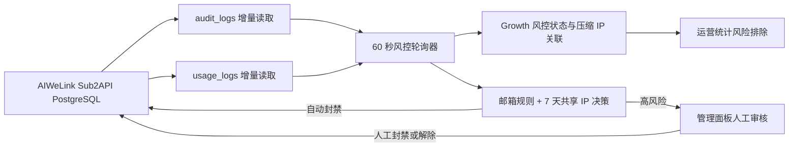

# AIWeLink 批量注册风控设计

日期：2026-08-17

状态：已确认，待实施计划

目标分支：`achernar/dev`

## 1. 目标

为 AIWeLink（Sub2API）增加近实时风控，识别利用邮箱点号或 `+标签`批量注册、共享 IP 盗刷免费额度的账号，并在高置信度命中后自动停用用户及其 API Key。

系统同时提供高风险人工审核、封禁归因、封禁和解除历史、人工误报例外，以及运营统计排除。AIGCLink 不在本期范围内。

## 2. 已确认规则

### 2.1 邮箱规则

对邮箱去除首尾空白并转为小写，再检查 `@` 前的 local-part：

- local-part 包含 `.`，命中 `email_local_part_dot`；
- local-part 包含 `+` 且 `+` 后存在标签，命中 `email_plus_tag`；
- 规则适用于所有邮箱域名，不限 Gmail、Outlook 或 Hotmail；
- 无法解析为单一 `local-part@domain` 的邮箱不自动封禁，只记录解析失败证据。

邮箱规则命中本身不足以自动封禁，必须同时满足共享 IP 条件。

### 2.2 共享 IP 规则

共享 IP 使用滚动 7 天窗口，将以下来源联合去重：

- 注册和用户执行日志：`audit_logs.client_ip`；
- 成功调用日志：`usage_logs.ip_address`。

账号关联规则：

- 用户执行日志优先使用 `actor_user_id`，缺失时使用 `actor_email` 反查用户；
- `auth.register` 事件没有 `actor_user_id` 时，仅从请求体解析邮箱并反查用户；
- 调用日志直接使用 `user_id`；
- 同一账号、同一 IP、同一来源多次出现只算一个关联账号；
- 同一 IP 在 7 天内关联至少 3 个不同账号，才命中 `shared_ip_7d`；
- 两个账号共享 IP 只保存普通关联，不形成共享 IP 风险信号。

### 2.3 决策矩阵

| 邮箱规则 | 7 天共享 IP（至少 3 个账号） | 结果 |
| --- | --- | --- |
| 命中 | 命中 | 立即自动封禁该邮箱规则命中的账号 |
| 命中 | 未命中 | 标记高风险，等待人工审核 |
| 未命中 | 命中 | 标记高风险，等待人工审核 |
| 未命中 | 未命中 | 不建立风险账号，只保留必要的压缩 IP 关联 |

共享 IP 集群中邮箱正常的账号不被连带自动封禁。人工审核可以将高风险账号手动封禁或标记为误报。

## 3. 架构

风控作为 AIWeLink 专用模块运行，不改变 AIGCLink 逻辑，也不等待现有 15 分钟运营同步。

### 3.1 模块边界

- `risk.adapters.sub2api`：只负责源表查询、邮箱和用户映射、源库封禁与恢复命令；
- `risk.domain`：邮箱规则、IP 归一化、共享 IP 聚合和决策矩阵，不依赖数据库；
- `risk.repository`：Growth 风控表、游标、事件和运营排除持久化；
- `risk.service`：轮询编排、跨库幂等、人工操作和查询接口；
- `risk.scheduler`：60 秒循环、站点级互斥和健康状态；
- 风控前端：列表、详情、事件时间线、数据源健康和人工操作。

## 4. 增量轮询与数据流

### 4.1 调度

- 仅处理站点 `aiwelink`；
- 固定间隔 60 秒；
- 使用 Growth PostgreSQL advisory lock 保证多实例同一时刻只有一个 AIWeLink 风控轮询；
- 首次启用回溯最近 7 天；
- 首次回溯会按正式规则建立高风险账号并执行自动封禁，不使用隐藏的 dry-run 分支；
- 后续分别按 `audit_logs.id` 和 `usage_logs.id` 增量读取；
- 增量批次使用有界分页，避免单轮加载无限行；
- 已写入的源记录以唯一键去重，轮询重试不会重复计数或重复封禁。

### 4.2 日志解析

`audit_logs`：

- 只读取 `id`、`created_at`、`actor_user_id`、`actor_email`、`action`、`path`、`client_ip` 和注册事件所需的 `request_body`；
- 原始 `request_body` 只在进程内解析，不写入 Growth、不写日志；
- 只持久化抽取后的邮箱、IP、源记录 ID 和时间；
- 管理员、系统任务和无法关联 AIWeLink 用户的审计记录不参与账号聚合。

`usage_logs`：

- 只读取 `id`、`user_id`、`ip_address` 和 `created_at`；
- 空 IP、无法解析的 IP 和空用户 ID 不参与共享 IP 判断；
- IPv4 和 IPv6 使用标准库解析并保存规范文本，避免同一地址因格式差异重复。

### 4.3 7 天窗口

每轮将新增观察 upsert 为账号-IP-来源聚合，更新：

- `first_seen_at`；
- `last_seen_at`；
- `event_count`；
- 最新源记录 ID。

共享 IP 查询只使用 `last_seen_at >= now() - interval '7 days'` 的关联，并按 IP 统计不同 `external_user_id`。风险决策只针对进入至少 3 个不同账号集群的账号。

每轮同时重算当前风险原因。邮箱规则命中会持续保留邮箱高风险原因；仅因共享 IP 被标记的正常邮箱账号，在其所有共享 IP 证据退出 7 天窗口后转为 `cleared`，并追加 `risk_cleared` 事件。

## 5. 数据模型

### 5.1 `growth.risk_settings`

每个站点一条运行设置：

- `site_id`；
- `detector_enabled`；
- `auto_ban_enabled`；
- `poll_interval_seconds`，AIWeLink 固定为 60；
- `ip_window_days`，AIWeLink 固定为 7；
- `shared_ip_min_accounts`，AIWeLink 固定为 3；
- `updated_by`、`updated_at`。

阈值按已确认值固化，管理面板只提供检测器和自动封禁的紧急暂停/恢复开关。首次 migration 创建设置但保持暂停；部署完成后由有写权限的管理员在风控页确认数据源状态并显式启用。启用后，符合规则的候选在当前轮询内直接封禁。

### 5.2 `growth.risk_sync_cursors`

每个站点和来源一条游标：

- `site_id`；
- `source_stream`：`audit_logs` 或 `usage_logs`；
- `last_source_id`；
- `last_source_created_at`；
- `last_success_at`；
- `last_error_code`、`last_error_message`；
- `updated_at`。

主键为 `(site_id, source_stream)`。

### 5.3 `growth.risk_accounts`

保存每个风险账号的当前状态：

- `risk_account_id` UUID；
- `site_id`、`external_user_id`，二者唯一；
- `email`、`normalized_email`；
- `risk_status`：`high_risk`、`ban_pending`、`banned`、`ban_failed`、`released`、`cleared`；
- `risk_reasons` JSONB，仅保存结构化规则名和摘要；
- `first_detected_at`、`last_detected_at`；
- `banned_at`、`released_at`；
- `is_stats_excluded`；
- `manual_override_active`；
- `manual_override_by`、`manual_override_at`、`manual_override_reason`；
- `created_at`、`updated_at`。

`manual_override_active` 独立于风险状态。误报账号使用 `risk_status = 'cleared'` 并启用人工例外；解除封禁账号使用 `risk_status = 'released'` 并启用人工例外。

### 5.4 `growth.risk_ip_accounts`

保存压缩后的 IP 关联：

- `site_id`、`external_user_id`；
- `ip_address` 使用 PostgreSQL `INET`；
- `source_type`：`registration_audit`、`user_audit`、`usage_log`；
- `first_seen_at`、`last_seen_at`；
- `event_count`；
- `latest_source_id`。

唯一键为 `(site_id, external_user_id, ip_address, source_type)`。按 `(site_id, ip_address, last_seen_at)` 和 `(site_id, external_user_id, last_seen_at)` 建索引。

### 5.5 `growth.risk_actions`

保存需要跨数据库执行和重试的命令：

- `risk_action_id` UUID；
- `idempotency_key`，全局唯一；
- `risk_account_id`、`site_id`、`external_user_id`、`email`；
- `action_type`：`auto_ban`、`manual_ban`、`manual_release`；
- `action_status`：`pending`、`running`、`succeeded`、`failed`、`conflicted`；
- `decision_reason`；
- `matched_email_rules` JSONB；
- `shared_ip_evidence` JSONB；
- `source_user_status_before`；
- `source_api_key_states_before` JSONB，仅保存 Key ID、原状态和源更新时间；
- `attempt_count`、`error_code`、`error_message`；
- `requested_by`、`requested_at`、`started_at`、`completed_at`。

action 行允许从 pending 更新到终态，用于崩溃恢复和幂等重试。执行器只消费 pending/可重试 failed action。

### 5.6 `growth.risk_events`

保存不可变的判断和操作事件：

- `risk_event_id` UUID；
- `risk_account_id`、`site_id`、`external_user_id`、`email`；
- `event_type`：`high_risk_detected`、`risk_cleared`、`auto_ban_succeeded`、`auto_ban_failed`、`manual_ban_succeeded`、`manual_release_succeeded`、`manual_release_partial`、`manual_override_set`、`manual_override_removed`、`detector_paused`、`detector_resumed`；
- `decision_reason`；
- `matched_email_rules` JSONB；
- `shared_ip_evidence` JSONB，只保存 IP、来源、关联账号数和时间范围；
- `risk_action_id`，操作事件关联对应 action；
- `event_result`、`error_code`、`error_message`；
- `actor_id`、`actor_name`；
- `created_at`。

事件只追加、不更新。重复证据使用确定性幂等键，不为每次轮询追加同一状态事件。只有风险状态变化或 action 产生终态结果时才写新事件。

### 5.7 运营统计字段

`growth.ops_user_snapshots` 增加：

- `is_risk_excluded BOOLEAN NOT NULL DEFAULT FALSE`；
- `risk_account_id UUID NULL`。

`risk_status = 'banned'` 时设置风险排除；`high_risk` 不排除。所有运营汇总、趋势、生命周期、留存、模型和客户排行统一排除 `is_risk_excluded = TRUE` 的账号，且不把风险账号归类为内部用户。

同时将已封禁账号同步到现有 `growth.user_exclusions`，`source = 'rule'`，供访问流量分析使用。解除误封后停用该排除记录并重算该账号从注册时间起的历史运营聚合。

## 6. 自动封禁

### 6.1 高置信度候选

账号必须同时满足：

1. 邮箱 local-part 命中点号或 `+标签`规则；
2. 最近 7 天任一注册、用户执行或成功调用 IP 关联至少 3 个不同账号；
3. 没有有效人工例外；
4. 尚未处于本系统已确认的 `banned` 状态。

历史上存在可核验付款的账号，即使同时命中邮箱规则与共享 IP，也只标记为 `high_risk` 进入人工审核，暂不自动封禁。付款历史联合检查 Sub2API 已完成且实付金额大于零的订单，以及 Growth 已分类且现金金额大于零的销售记录。

自动封禁只作用于候选账号，不作用于同 IP 集群中的正常邮箱账号。

### 6.2 跨库幂等流程

Growth 和 Sub2API 是两个独立数据库，不能使用单一事务。流程采用预记录、源库事务和可恢复状态：

1. 从源库读取用户和 API Key 当前状态及 `updated_at`；
2. 在 Growth 创建带确定性幂等键的 pending `risk_action`，保存封禁前状态；
3. 在 Sub2API 事务中锁定用户和相关 API Key；
4. 若状态或 `updated_at` 与预记录不一致，则回滚并重新评估，不覆盖并发管理员操作；
5. 将用户 `status` 更新为 `disabled`；
6. 只将原状态为 `active` 的 API Key 更新为 `inactive`；
7. 提交源库事务后，将 action 改为成功、追加成功事件并设置统计排除；
8. 若 Growth 完成写回失败，保留 pending action，下一轮检查源状态后补齐成功结果；
9. 若源库失败，在 action 记录失败原因和重试次数，并追加失败事件；可重试错误在下一轮幂等重试。

直接更新源库的前提已现场确认：当前 AIWeLink SQL 账号对 `users` 和 `api_keys` 具有 UPDATE 权限，Sub2API 认证逻辑识别 `users.status = 'disabled'`，API Key 已存在 `inactive` 状态。

## 7. 人工审核、封禁和解除

### 7.1 高风险审核

高风险账号支持：

- 人工确认封禁：复用自动封禁执行器，但事件类型为 `manual_ban_succeeded`；
- 标记误报并建立例外；
- 查看共享 IP 集群和关联账号，但不能一键连带封禁所有账号。

所有写操作必须填写备注，并使用当前后台操作者身份写入事件。

### 7.2 解除封禁

解除时只恢复本次风控实际修改的内容：

- 用户当前仍为本次设置的 `disabled` 状态时，恢复封禁前用户状态；
- API Key 当前仍为本次设置的 `inactive` 且源更新时间未被后续操作改变时，恢复封禁前状态；
- 已被其他管理员修改的用户或 Key 不覆盖，结果记为 `manual_release_partial`；
- 成功或部分解除都必须保存操作者、时间、备注和逐项结果；
- 解除后创建账号级人工例外，避免同一不可变邮箱和历史证据在下一轮立即重新封禁；
- 管理员可以在详情页撤销例外，使账号重新参与自动判断。

解除误封后清除风险统计排除，并重新计算该账号从注册时间起对运营统计的贡献。

## 8. 管理 API 与前端

### 8.1 API

在现有运营管理权限和 AIWeLink 站点权限下提供：

- 风控概览；
- 风险账号分页列表和筛选；
- 风险账号详情；
- 共享 IP 集群列表和详情；
- 风控事件分页列表；
- 可重试动作和失败动作列表；
- 人工封禁；
- 解除封禁；
- 设置和撤销误报例外；
- 轮询器与两个数据源健康状态；
- 检测器和自动封禁的紧急暂停/恢复。

所有列表限制页大小，SQL 使用绑定参数。邮箱和 IP 只对有 AIWeLink 运营权限的后台用户展示。

### 8.2 前端

运营管理页增加“风控”标签，保留现有无嵌套卡片的页面风格。页面包含：

- 自动封禁、高风险待审核、近 7 天共享 IP 集群和最近失败动作摘要；
- 状态、规则、邮箱、IP、时间范围筛选；
- 风险账号表：邮箱、状态、命中规则、共享 IP 数、最大关联账号数、首次发现、最近检测、封禁时间；
- 共享 IP 表：IP、来源、关联账号数、首次/最近出现；
- 详情抽屉：判断公式、IP 来源、关联账号、封禁前状态和事件时间线；
- 人工封禁、解除封禁、标记误报和撤销例外操作；
- 检测器和自动封禁的运行状态及紧急暂停开关；
- 操作确认框和必填备注；
- 审计与调用数据源的最新时间、覆盖状态和错误信息。

鼠标悬停在规则、风险状态和统计字段上时显示含义、窗口和公式。

## 9. 数据量、保留与性能

风控不复制原始日志，只保存压缩关联和状态变化。

现场只读估算：

- `usage_logs` 当前约 55.7 万行；
- 一个有数据的 7 天窗口约 25.4 万条调用，压缩后约 960 条账号-IP 关系；
- 当前最近 7 天 `audit_logs` 约 2,600 条，压缩后约 56 条账号-IP 关系。

保留规则：

- `risk_accounts` 每个账号最多一条；
- `risk_ip_accounts` 保留 30 天，后台每日清理 `last_seen_at` 超期记录；
- 共享 IP 判断只读取最近 7 天；
- `risk_actions` 只保存实际执行或待执行命令；
- `risk_events` 只记录状态变化和动作，不记录每次请求；
- 封禁、解除、失败和人工例外事件永久保留；
- 原始审计和调用日志保留策略仍由 Sub2API 管理。

轮询查询必须使用源表主键游标和时间索引。每批处理数量有上限，积压时连续分页但让出事件循环，避免长事务和内存峰值。

## 10. 数据源健康

现场检查发现：

- `audit_logs` 已更新到 2026-08-17；
- `usage_logs` 最新记录停在 2026-07-31；
- `ops_system_logs` 仍在更新且 `extra.client_ip` 存在，但没有可靠的用户 ID，不能替代成功调用账号-IP 关系。

因此系统必须显式展示两个来源的覆盖情况：

- 最新源记录时间；
- 最近成功轮询时间；
- 本轮读取行数；
- `current`、`delayed`、`stale` 或 `empty` 状态；
- 最近错误。

覆盖状态按源记录最新时间计算：15 分钟内为 `current`，15 分钟至 24 小时为 `delayed`，超过 24 小时为 `stale`，从未出现为 `empty`。该状态表示风控证据覆盖年龄，不等同于数据库连接健康；没有新业务流量时可以出现 delayed/stale，但页面必须如实显示最新证据时间。

过期 `usage_logs` 不作为当前 7 天证据，也不阻止 `audit_logs` 独立形成共享 IP 证据。页面不能把“没有新调用”伪装成健康的实时调用 IP 覆盖。调用日志停写原因属于独立故障，需要后续排查，但不扩大本期风控实现范围。

## 11. 失败处理

- Growth schema 未初始化：轮询器不启动封禁，健康状态显示 schema 错误；
- 检测器或自动封禁被紧急暂停：继续展示已有数据；检测器暂停时不读取新证据，自动封禁暂停时仍更新高风险判断但不创建 auto-ban action；
- Sub2API 不可连接：不推进对应游标，记录错误并在 60 秒后重试；
- 单条邮箱或 IP 无法解析：跳过该证据，记录结构化原因，不中断批次；
- 风险 action 预记录失败：不执行源库封禁；
- 源库封禁失败：保留 pending/failed action 并重试，不设置统计排除，同时追加失败事件；
- 源库已提交但 Growth 完成写回失败：下一轮根据 pending action 和源状态补齐；
- 统计重算失败：账号仍保持封禁和排除标记，重算进入可重试状态并在页面显示；
- 人工解除发生状态冲突：不覆盖源库新状态，返回部分解除明细。

## 12. 测试

### 12.1 领域单元测试

- 所有域名下的点号 local-part；
- 所有域名下的 `+标签`；
- 非法邮箱、空 local-part、多个 `@`；
- IPv4、IPv6、空 IP 和无效 IP；
- 7 天边界；
- 两个账号不命中、三个账号命中；
- audit 与 usage 联合去重；
- 同一账号重复调用不放大关联账号数；
- 自动封禁决策矩阵和人工例外。

### 12.2 仓储与服务测试

- 游标分页、首轮 7 天回溯和重试去重；
- 紧急暂停、恢复和首次显式启用；
- 风险表 upsert、30 天清理和查询索引；
- pending -> succeeded/failed 状态机；
- action 可变状态与 event 追加审计的边界；
- 用户和 API Key 封禁事务；
- 预记录状态冲突时回滚；
- 源库成功、Growth 写回失败后的恢复；
- 手动解除全部成功和部分成功；
- 运营统计历史排除与恢复重算；
- 权限和 AIWeLink 站点范围。

### 12.3 前端测试

- 风控概览和空状态；
- 风险账号、共享 IP 和事件筛选；
- 规则公式 tooltip；
- 详情抽屉证据和时间线；
- 人工封禁、解除和误报确认流程；
- 必填备注、失败反馈和部分解除提示；
- 数据源 stale 状态明确显示。

## 13. 非目标

- 不处理 AIGCLink；
- 不因共享 IP 单独自动封禁；
- 不因两个账号共享 IP 形成共享 IP 风险信号；
- 不复制原始请求体、密码、Token、API Key 或完整原始日志；
- 不自动封禁共享 IP 集群中的正常邮箱账号；
- 不把风险账号归类为内部用户；
- 不在本期修复 `usage_logs` 自 2026-07-31 停写的根因。
